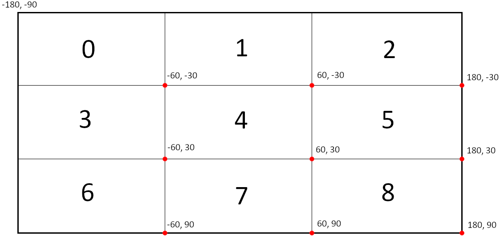

# Distributed Systems - College Course Work

This project seeks to implement a distributed system for geolocalization and access control of means of transportation, typically electric (scooters, bikes, etc.).

## Project Specifications

### Embedded System
To be embedded on the vehicle. 
Responsible for keeping track of geoposition and making sure the vehicle is only usable once the server authorizes access.

### Server Side
Responsible for keeping track of general status of users, vehicles, and other equipment. 
Should be able to detect improper use of the vehicles (exiting a specified zone - geofencing -, for example).

### User Interface
Allows the user to request access to the server and unlock a vehicle.

## Planned Testing
- Stress testing for several vehicles operating simultaneously
- Server recovery after crash
- Client recovery after crash

## TCP Implementation

The original TCP implementation (including readme) is available with:

```git checkout d0f4eca```

## gRPC Implementation

The gRPC implementation used the original network protocol implemented in TCP as a baseline, applying it to the services/remote procedures model, described by [`.proto` files](src/spidServer/proto_files).

### Multiple Servers

The SPID network is no longer limited to one server. In the server bootstrap stage, a request is sent to a [server mapper](src/spidServer/spid_mapper.py), which is responsible for building the routing table of each one of the servers that will compose the network (number is set when creating the server instances).

#### Client to Server Connections

It is assumed that a client will somehow know the address to a random server in the network. In the client's point of view, it does not (and should not) need to know about the existence of the other servers.

#### Server to Server Connections

The server network can be thought of as a 2D square matrix with order `k`, with each server numbered from `0` to `n-1`, with , from the top-left to the bottom-right. It should be noted the amount of servers can only be a perfect square (i.e. `1, 4, 9, 16, ...`).

One of the requisites, outlined in the previous section, is that a client connecting to the network must be able to access data maintained by **any** server by making requests to **any** other server. To accomplish this specification, a server must be connected to a reasonable amount of other servers (not connected to all, and not too few connections), the following logic is being used: each server is directly connected to the servers with distances equal to powers of two (i.e. `1, 2, 4, 8...` in all six main cardinal directions (N, S, W, E, NW, NE, SW, SE). The following diagram represents this logic applied to some servers in a network with 2500 servers in total (50 by 50).


*Black dots are the servers. The red `x` is the selected server. The blue circles are the servers to which it is connected.*

Thus, it can be shown that the maximum amount of connections `m` a single server will make is upper-bounded by the number of connections the server at center of the matrix makes. That value is given by:

}\right\rfloor)

This way, when a client makes a request to a random server, this server will be able to redirect the request to the one closest to the server responsible for the data in the request, process which can be repeated until reaching the target server.

#### Data Mapping

The distribution of the data related to the system entities is done in two ways across the network. 

The first one considers the entity unique identifier, taking into account the need for an uniform load distribution, avoiding the overload of a small set of servers. To do that, it is assumed the algorithm used for the generation of the entity's [`uuid`](https://en.wikipedia.org/wiki/Universally_unique_identifier) is reasonably random. 

That way, it is possible to use a simple relation, such as 


to compute the server number for the entity's "home agent", that is, the server which will always be responsible for that entity's data throughout all of it's existence in the network.

The second method of mapping offers both data redundancy and convenience to the network clients, and it is based on the location of the entity. Upon registering, an entity must have a global position - a `(Longitude, Latitude)` pair -, ranging from -180° to 180° in longitude and from -90° to 90° in latitude. The network matrix can then be used as an abstraction for a global map: going up and down the rows means going up and down in latitude; going left and right in the columns means going left and right in longitude. A visual representation of what that would look like for  follows:



In this example, server `0` is responsible for entities in the range `(-180°, -90°)` to `(-60°, -30°)`, `1` for the range `(-60°, -90°)` to `(60°, -30°)`, and so on.

This way, data that is already available in the home agents is duplicated, offering some redundancy, and the convenience when requesting the available entities in a given region. The home agent is responsible for keeping track of region changes, sending `add_remote`, `update_remote`, and `remove_remote` requests to the correct servers (the "remote agents") involved when an entity has its position changed.

#### Recovery From Server Failure

Every few seconds, each server saves its own memory state to file. In case a server fails and goes down after a modification and before a state save, there must be a way to recover these changes made. For that reason, on every write-to-memory action, the exact modification is logged to a separate file, which is cleared after a state save. When a server boots up, it checks it there are any logged (i.e. unprocessed) write actions, then applies theses actions on the previous saved state, effectively recovering the server state before it went down.
